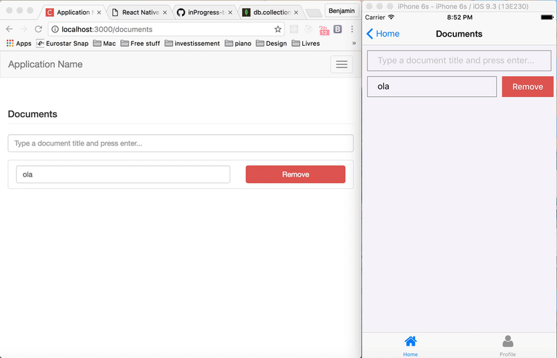

# Meteor + React Native CRUD

A starting point for Meteor apps + React Native CRUD.

Done with 2 awesome repos:

- [The Meteor Chef - Base](https://github.com/themeteorchef/base)
- [Spencer Carli's React Native Meteor Boilerplate](https://github.com/spencercarli/react-native-meteor-boilerplate)

<table>
  <tbody>
    <tr>
      <th>Base Version</th>
      <td>v4.6.0</td>
    </tr>
    <tr>
      <th>Meteor Version</th>
      <td>v1.4</td>
    </tr>
  </tbody>
</table>

Note: the Update is not reactive. When you do an update on the RNApp, you have to make a refresh on the MeteorApp // When you do an update on the MeteorApp, you have to make a refresh on the RNApp.

[Read the Documentation](http://themeteorchef.com/base)

## Preview

## Get started

- In the RNApp folder (the React Native App) run ``npm install``

### Running on iOS Simulator

- In the MeteorApp folder launch the app with ``meteor npm install`` then ``meteor`` (your app will run on the localhost)

- In the RNApp, in a new terminal run ``react-native run-ios``
